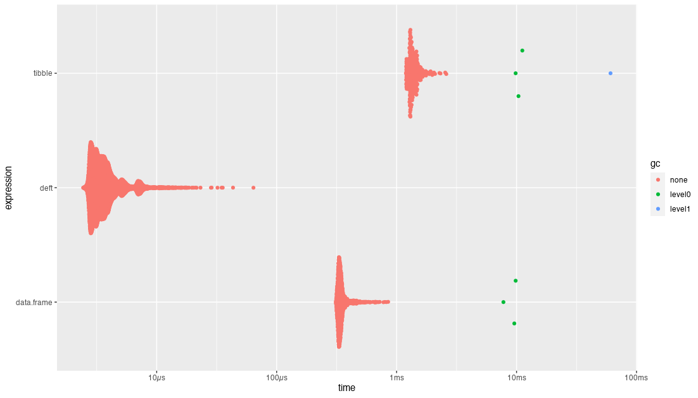

<!-- README.md is generated from README.Rmd. Please edit that file -->

```{r, include = FALSE}
knitr::opts_chunk$set(
  collapse = TRUE,
  comment = "#>",
  fig.path = "man/figures/README-",
  out.width = "100%"
)

library(deft)
```

# deft

<!-- badges: start -->

<!-- badges: end -->

`{deft}` is an R package providing a library of C code for 
fast creation and manipulation of data.frames.  Creation and manipulation
take place in C before returning the data.frame to R.

An example of how to use this C code in your own package is provided in [`{deftly}`](https://github.com/coolbutuseless/deftly).

Aims:

* Fast creation of data.frames in C
* Fast addition of rows to a data.frame (also within C)
* Focussed on dealing with situation where final number of rows in data.frame
  are *not* known ahead of time.
* Efficient memory allocation i.e. over-allcate memory in the data.frame, 
  and reallocate (by doubling the size) whenever addition of new data 
  would exceed current allocation.
* Operations all happen "in-situ" and avoid unnecessary copying and re-allocation. 


## What's in the box

* `deft_benchmark()` is a simple R function that calls a C function to create a data.frame
  in C, add some rows to it and return.  It doesn't do anything useful
  except help with some benchmark timing (below).
* Everything else is for use within C.  See the `LinkingTo` documentation below.


## Installation

You can install from [GitHub](https://github.com/coolbutuseless/deft) with:

``` r
# install.package('remotes')
remotes::install_github('coolbutuseless/deft')
```


## Limitations

This package is **not** intended as a way to create data.frames from R.

Instead, it is focussed on creating/modifying data.frames within C, and 
returning the final result to an R session.

When adding rows to a data.frame within C, it is the caller's responsibility
to pass in the correct number and type of variables needed in the data.frame.

There is little in the way of sanity checking done within the C code, and
this could lead to corrupt data.frames if you are not paying attention.


## `LinkingTo` - how to use this C code in your R package.

* In `DESCRIPTION`:
    * `LinkingTo: deft`
    * `Depends: deft`
* Add `#include <deft.h>` somewhere in your code
* Use the following functions:
    * `SEXP df_create(int ncol, char **names, int *types)` - creates a data.frame
    * `void df_add_row(SEXP df, ...)` - adds a row to the data.frame. 
        * The `...` **must** match the number and type of values expected by the data.frame.
    * `void df_truncate_to_data_length(df)` - the final call to prepare the
       data.frame to return to R.  

An example of how to use this C code in your own package is provided in [`{deftly}`](https://github.com/coolbutuseless/deftly).

```{c eval=FALSE}
//~~~~~~~~~~~~~~~~~~~~~~~~~~~~~~~~~~~~~~~~~~~~~~~~~~~~~~~~~~~~~~~~~~~~~~~~~~
// DEMO
//~~~~~~~~~~~~~~~~~~~~~~~~~~~~~~~~~~~~~~~~~~~~~~~~~~~~~~~~~~~~~~~~~~~~~~~~~~
SEXP deft_benchmark_(SEXP n_) {
  
  int nprotect = 0;
  int n;
  
  n = asInteger(n_);
  
  //~~~~~~~~~~~~~~~~~~~~~~~~~~~~~~~~~~~~~~~~~~~~~~~~~~~~~~~~~~~~~~~~~~~~~~~~~~
  // Create dataframe
  //~~~~~~~~~~~~~~~~~~~~~~~~~~~~~~~~~~~~~~~~~~~~~~~~~~~~~~~~~~~~~~~~~~~~~~~~~~
  char *names[5] = {    "x",    "y",    "z",  "lgl", "list"};
  int   types[5] = {REALSXP, INTSXP, STRSXP, LGLSXP, VECSXP};
  SEXP df = PROTECT(df_create(5, names, types));  nprotect++;
  
  //~~~~~~~~~~~~~~~~~~~~~~~~~~~~~~~~~~~~~~~~~~~~~~~~~~~~~~~~~~~~~~~~~~~~~~~~~~
  // Add values
  //~~~~~~~~~~~~~~~~~~~~~~~~~~~~~~~~~~~~~~~~~~~~~~~~~~~~~~~~~~~~~~~~~~~~~~~~~~
  for (int i = 0; i < n; i++) {
    // It is the caller's responsibility to ensure that the number and type
    // of the values passed to 'dv_add_row' are correct
    //
    //              double  , integer, char*, integer, SEXP
    df_add_row(df, (double)i, i, names[1], i % 2, ScalarInteger(i));
  }
  
  //~~~~~~~~~~~~~~~~~~~~~~~~~~~~~~~~~~~~~~~~~~~~~~~~~~~~~~~~~~~~~~~~~~~~~~~~~~
  // Truncate to data length just prior to returning to R
  // This function *MUST* be called on any data.frame created by this code.
  // This function:
  //    * Trims the data to the actual data length
  //    * Sets the GROWABLE bit to indicate that it has been truncated
  //    * sets rownames (without which R will complain very very loudly 
  //        that the data.frame is corrupt)
  //~~~~~~~~~~~~~~~~~~~~~~~~~~~~~~~~~~~~~~~~~~~~~~~~~~~~~~~~~~~~~~~~~~~~~~~~~~
  df_truncate_to_data_length(df);
  
  
  UNPROTECT(nprotect);
  return df;
}
```


# Benchmark

There is just one simple R function in this package, and its only use is
for benchmarking.

`deft_benchmark(n)` creates a data.frame totally within C and returns it
to R.  The only argument is the number of rows to return.  There is otherwise no
ability to control the contents of the data.frame.

```{r example}
library(deft)

# Generate a demo data.frame with 7 rows
deft_benchmark(n = 7)
```

### Compare timing

The following code is a rough timing comparison when creating a single-row
data.frame using:

* `tibble()`
* the standard `data.frame()` call 
* this library.

For this naive case of generating a small data.frame,
 `{deft}` is ~100x faster than the other options. 

```{r eval=FALSE}
df <- bench::mark(
  tibble     = tibble(x = 1L, y=2, z="three", lgl = FALSE, ll = list(1)), 
  data.frame = data.frame(x = 1L, y=2, z="three", lgl = FALSE),
  deft       = deft_benchmark(1), 
  check = FALSE
)
```

```{r eval=FALSE, echo=FALSE}
library(ggplot2)
library(tidyr)
plot(df)
```




## Related Software

* [insitu](https://github.com/coolbutuseless/insitu) - an R package I wrote
  for in-place manipulation of R vectors.

## Acknowledgements

* R Core for developing and maintaining the language.
* CRAN maintainers, for patiently shepherding packages onto CRAN and maintaining
  the repository
